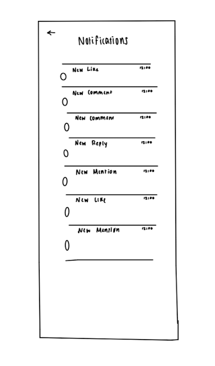
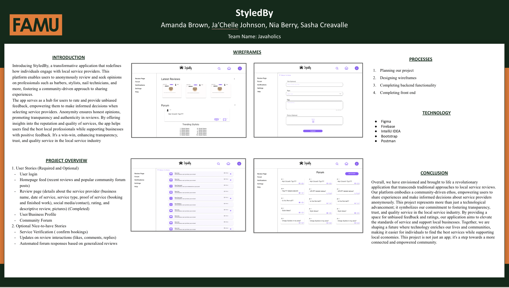

## Table of Contents
1. [Overview](#styledby-overview)
2. [Product Spec](#product-spec)
4. [Wireframes](#wireframes)
5. [Schema](#schema)

## StyledBy Overview
### Description 
A comprehensive application for individuals to anonymously review and seek opinions on local service providers, fostering a community-driven approach to sharing experiences with barbers, stylists, nail techs, and more. The app creates a space for users to rate and provide unbiased feedback on these professionals, facilitating informed decisions for others seeking quality services. 

## App Evaluation
- **Category**: Lifestyle/Social Forum & Community Chats
- **Story**: Allows users to anonymously review local service providers and share/inquire about experiences and recommendations.
- **Market**: Any individual in the local community interested in cosmetic services could choose to use this app.
- **Habit**: This app could be used as often as the user wanted depending on how frequently they use local services.
- **Scope**: This app would start off serving local (Tallahassee) citizens and will then branch out to support other local communities throughout the country.

## Product Spec
### 1. User Stories (Required and Optional)
**Required Must-have Stories**
- User login
- Homepage feed (recent reviews and popular community forum posts)
- Review page (details about the service provider (business name, date of service, service type, proof of service (booking and finished work), social media/contact), rating, and descriptive review, pictures)
- User Profile
- Community Forum

**Optional Nice-to-have Stories**
- Service Verification  ( confirm bookings)
- Business Profile
- Updates on review interactions (likes, comments, replies)
- Automated forum responses based on generalized reviews
- Settings (Accessibility, Notification, General, etc.
- Notifications for: business owners when their business is mentioned;  users who asked a question on the forum and received a response; flagged or reported posts/reviews
- Search for local businesses and see their reviews

## 2. Screens
- Login
- Register - User signs up or logs into their account
  - Upon Download/Reopening of the application, the user is prompted to log in to         gain access to their profile information.
- Add Page
  - Where users write reviews & forums
  - Hovering button on all tabs that lets you select review or forum to write
- Add Review + Add Forum (2 pages)
- Homepage - Recent reviews/ community forum posts
  - “Leave a Review” Option
  - Filter Options
- Profile Screen
  - User - sees recent reviews and forum posts

## 3. Navigation
**Tab Navigation** (Tab to Screen)
- Homepage
- Notifications
- Search
- Profile

**Optional:**
- Add Page
- Settings

**Flow Navigation** (Screen to Screen)
- Anywhere -> Enter Details & Review -> Confirm Honesty -> Submit a Review
- Anywhere ->  Enter Question -> Submit a Forum Post
- Notifications -> Click Single Review -> see notification details
- Homepage->(optional) Filter Forums -> Click answer button -> Answer a Forum Post
- Search -> type business -> toggle tabs -> click review - > View review details
- Forced Log-in -> Account creation if no log-in is available
- Profile -> Text field to be modified.
- Settings -> Toggle settings

## Wireframes
### Low Fidelity 

### High Fidelity 
.png)
.png)
.png)
.png)
.png)
.png)
.png)
.png)
.png)
.png)
.png)
.png)
.png)

### Interactive Prototype 

## Schema 
### Data Models 
**User**
| Property    | Type         | Description                                              |
|-------------|--------------|----------------------------------------------------------|
| userId      | String       | Unique identifier for user                               |
| username    | String       | User's selected username, changeable                     |
| email       | String       | Email of user                                            |
| reviews     | List<Reviews>| Array of reviews the user has written or commented on    |
| forums      | List<Forums> | Array of forums the user has written or replied to       |
| saved       | List<Forums> | Array of forums the user has saved                       |

**Business**
| Property     | Type          | Description                                                        |
|--------------|---------------|--------------------------------------------------------------------|
| businessId   | String        | Unique identifier for business                                     |
| category     | String        | Category of stylist (Hair, skin, nail, other/lifestyle)            |
| numReviews   | List<Reviews> | Number of reviews on that individual                               |
| rating       | float         | Overall rating {1-5} of business based on reviews                  |
| reviews      | List<Reviews> | Reviews business was mentioned in                                  |

**Forum Post**
| Property    | Type            | Description                                        |
|-------------|-----------------|----------------------------------------------------|
| fPostId     | String          | Unique identifier for post                         |
| postedBy    | User            | Reference to user that posted the forum post       |
| topic       | String          | Topic of post (can be null)                        |
| description | String          | Description of post                                |
| photos      | List\<String\>  | Array of Strings, File path to photo               |
| title       | String          | Title of post                                      |
| likes       | List\<Likes\>   | Array of likes                                     |
| postedAt    | Timestamp       | Timestamp of when post was made                    |

**Review**
| Property        | Type            | Description                                           |
|-----------------|-----------------|-------------------------------------------------------|
| rPostId         | String          | Unique identifier for post                            |
| createdBy       | User            | Reference to user that posted the review              |
| business        | Business        | Reference to business reviewed                        |
| serviceType     | String          | Type of service (Hair, Skin, Nails, Other)            |
| description     | String          | Content of review                                     |
| rating          | Rating          | Numerical rating of service (1, 2, 3, 4, 5)           |
| photos          | List\<String\>  | Array of Strings, File path to photo                  |
| createdAt       | Timestamp       | Time review was created at                            |

**Comment**
| Property     | Type       | Description                                         |
|--------------|------------|-----------------------------------------------------|
| commentId    | String     | Unique identifier for comment                       |
| senderId     | User       | UserId of user sending the comment                   |
| receiverId   | User       | UserId of user receiving the comment                 |
| time         | Timestamp  | Timestamp of when the comment was made              |
| content      | String     | Content of the comment                              |

**Like**
| Property     | Type       | Description                                           |
|--------------|------------|-------------------------------------------------------|
| likeId       | String     | Unique identifier for like                            |
| senderId     | User       | UserId of user sending the like                       |
| postId       | User       | UserId of user receiving the like                     |
| likedAt      | Timestamp  | Timestamp of when the like was made                   |

**Rating**
| Property       | Type       | Description                                           |
|----------------|------------|-------------------------------------------------------|
| ratingId       | String     | Unique identifier for rating                          |
| userId         | User       | UserId of user who created the rating                 |
| business       | Business   | businessId of business rating is for                  |
| ratingTime     | Timestamp  | Timestamp of when the rating was created              |
| ratingNum      | Array\<Int\>| Array of integers representing the rating (0-5)      |

**Saves**
| Property       | Type       | Description                                           |
|----------------|------------|-------------------------------------------------------|
| saveId         | String     | Unique identifier for save                            |
| userId         | User       | UserId of user who created the save                   |
| savedAt        | Timestamp  | Timestamp of when the rating was created              |
| forumId        | ForumPost  | fPostId for post that was saved                       |

### Networking

**Endpoints**

- api/users/
- api/users/{user_id}
- api/users/create
- api/business/
- api/business/{businessId}
- api/forumPosts/
- api/forumPosts/{fPostId}
- api/reviews/
- api/reviews/rPostId{fPost_id}
- api/reviews/create/

**List of network requests by screen:**

**Login Screen**
- (Read/GET) Query user information based on login credentials.

**Register Screen**
- (Create/POST) Create a new user account with provided credentials.

**Add Page**
- (Create/POST) Create a new review.
- (Create/POST) Create a new forum post.
- (Create/POST) Create a new business.

**Homepage**
- (Read/GET) Query recent reviews.
- (Read/GET) Query recent community forum posts.
- (Create/POST) Create a new review.
- (Create/POST) Create a new forum post.

**Profile Screen (User)**
- (Read/GET) Query reviews posted by the user.
- (Read/GET) Query recent forum posts created by the user.
- (Update/PUT) Update reviews information.
- (Update/PUT) Update forum post information.
- (Delete/DELETE) Delete review.
- (Delete/DELETE) Delete forum post.

### Existing API Endpoints

**Google Places API**
Base URL: https://maps.googleapis.com/
| **HTTP Verb** | **Endpoint**                      | **Description**                                               |
|-----------|---------------------------------------|---------------------------------------------------------------|
| GET       | /api/places/search                    | Allows users to search for businesses                         |
| GET       | /api/businesses/:placeId              | Retrieves detailed information about a specific business      |
| GET       | /api/businesses/:placeId/reviews      | Retrieves reviews for a specific business                     |
| GET       | /api/businesses/:placeId/photos       | Retrieves photos of a specific business                       |
| GET       | /api/places/autocomplete              | Provides autocomplete suggestions for business names/addresses|

**Instagram Basic API**

Base URL: https://graph.instagram.com/
| **HTTP Verb** | **Endpoint**                                | **Description**                                                 |
|-----------|-------------------------------------------------|-----------------------------------------------------------------|
| GET       | /users/self/media/recent                        | Retrieves recent media uploaded by the authenticated user       |
| GET       | /users/self                                     | Retrieves details about the authenticated user's profile        |
| GET       | /users/{user-id}/media/recent                   | Retrieves recent media uploaded by a specific user              |
| GET       | /users/{user-id}                                | Retrieves details about a specific user's profile               |
| GET       | /media/{media-id}                               | Retrieves details about a specific media object                 |
| GET       | /media/{media-id}/comments                      | Retrieves a list of comments for a specific media object        |
| GET       | /media/{media-id}/likes                         | Retrieves a list of users who have liked a specific media object|
| GET       | /locations/{location-id}                        | Retrieves details about a specific location                     |
| GET       | /locations/{location-id}/media/recent           | Retrieves recent media uploaded from a specific location        |
| GET       | /tags/{tag-name}                                | Retrieves details about a specific tag                          |
| GET       | /tags/{tag-name}/media/recent                   | Retrieves recent media with a specific tag                      |
| GET       | /businesses/{business-id}                       | Retrieves details about a specific business profile             |
| GET       | /businesses/{business-id}/media                 | Retrieves recent media uploaded by a specific business          |
| GET       | /businesses/{business-id}/locations             | Retrieves locations associated with a specific business         |
| GET       | /businesses/{business-id}/insights              | Retrieves insights for a specific business                      |

### Milestone 3 & 4 Build Progress Summary
In Milestone 4, our team continued to create our services and controllers. We created services and controllers for 
Users, Businesses, Comments, and Reviews. We also began the process of creating services and controllers for Likes and Forum Posts.
### Milestone 5 Build Progress

This sprint we built our main services and controllers for our data models. We added a Mentions and Ratings Data model as well.

### Milestone 6 Build Progress Summary

In Milestone 6, our team fixed errors that we were facing with our completed services and controllers. We also began creating on front end. Specifically, we began working on our template, login/register, and home page.

### Milestone 7 Build Progress Summary

In Milestone 7, continued to work on our front end, specifically designing our login, home page, and create reviews/forum posts. We made adjustments to these pages from the last milestone to incorporate bootstrap styling. We also continued to debug our services and controllers

### Final Poster 

